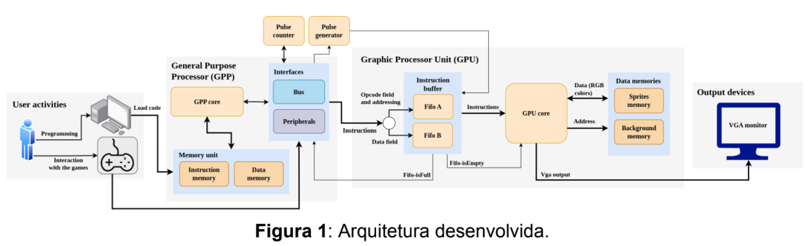

# Biblioteca de acesso a Unidade de Processador Gráfico para VGA em FPGA no DE1-SoC utilizada em um Jogo de Tetris

## Descrição
Este projeto envolve o desenvolvimento de uma biblioteca em assembly que controla uma Unidade de Processador Gráfico programada na FPGA da placa de desenvolvimento DE1-SoC para ser usada em um jogo de Tetris como interface de projeção dos frames na tela através da saída VGA. O jogo é controlado usando o acelerômetro para o movimento e botões da DE1-SoC para navegação no menu. A Unidade de Processador Gráfico foi desenvolvida por Gabriel Sá Barreto Alves no seu Trabalho de Conlusão de Curso.

## Índice
1. [Descrição](#descrição)
2. [Objetivos](#objetivos)
3. [Requisitos](#requisitos)
4. [Configuração de Hardware](#configuração-de-hardware)
5. [Como Compilar e Executar](#como-compilar-e-executar)
6. [Imagens](#imagens)
7. [Testes](#testes)
8. [Funcionamento do Acelerômetro e Botões](#funcionamento-do-acelerômetro-e-botões)
9. [Análise Final](#análise-final)
10. [Materiais de Pesquisa Adicionais](#materiais-de-pesquisa-adicionais)

## Objetivos
- Compreender uma arquitetura de um processador gráfico desenvolvido em uma FPGA.
- Programar em assembly para arquitetura ARM.
- Realizar syscalls usando assembly.
- Acessar arquivos e mapear endereços físicos para memória usando assembly.
- Manipular dados de memória mapeada usando Lightweight HPS-to-FPGA Bridge para acessar uma FGPA de uma placa de desenvolvimento DE1-SoC.
- Aplicar o conhecimento de interação entre a linguagem C e assembly para desenvolver uma biblioteca em assembly de acesso à Unidade de Processador Gráfico desenvolvida por Gabriel Sá Barreto Alves.
- Integrar a biblioteca no jogo Tetris localizado em https://github.com/alexsami-lopes/Digital-Systems-Tetris.git para que ela controle a projeção de frames na tela de um monitor conectado à interface VGA da DE1-SoC.

## Requisitos
- Placa de Desenvolvimento DE1-SoC
- Acelerômetro (ADXL345)
- Monitor VGA
- Botões e LEDs
- Sistema Operacional Linux (preferencialmente rodando em arquitetura ARM)
- Conhecimento de programação em FPGA
- Conhecimento básico de programação e interfaceamento entre as linguagens C e assembly para manipulação de hardware

## Configuração de Hardware
### Placa DE1-SoC
  - **CPU**: ARM Cortex-A9
  - **Memória**: 1GB DDR3
  - **Saída de Vídeo**: VGA
  - **Entrada**: Acelerômetro, botões

### Conexões
1. **Monitor VGA**: Conectar à saída VGA da DE1-SoC.
2. **Acelerômetro**: Conectar à interface I2C.
3. **Display de 7 Segmentos**: Conectar à interface do display HEX.
4. **Botões**: Conectar ao GPIO para entrada do usuário.
5. **LEDs**: Conectar ao GPIO para indicação de status.

### Unidade de Processador Gráfico desenvolvida por Gabriel Sá Barreto Alves
1. **GPU**: instalação da GPU na FPGA.
2. **Mapeamento**: Mapeamento usando a Lightweight HPS-to-FPGA Bridge.

## Como Compilar e Executar
1. **Clonar o Repositório**:
    ```bash
    git clone https://github.com/alexsami-lopes/Tetris-Using-VGA-on-FPGA.git
    cd Tetris-Using-VGA-on-FPGA-main
    ```

2. **Compilar o Código**:
    ```bash
    make
    ```

3. **Executar o Jogo**:
    ```bash
    sudo ./tetris
    ```

   Certifique-se de ter as permissões necessárias para acessar `/dev/mem`.

## Imagens
### Placa DE1-SoC e Configuração de Hardware


### Tela VGA Mostrando o Jogo


<p align="center">
  
</p>

## Testes
Durante a fase de testes, os seguintes passos foram realizados:
1. Desenvolvimento de uma biblioteca em C para testar o acesso à FPGA e projeção de um simples bloco na tela usando a VGA.
2. Adaptação do jogo para uso da biblioteca e testes de performance.
3. Conversão da lógida da biblioteca em C para assembly e testes de uso.
4. Garantir que o jogo continua a responder corretamente aos inputs do acelerômetro para movimento das peças.

## Acesso e funcionamento da Unidade de Processador Gráfico desenvolvida por Gabriel Sá Barreto Alves
Para acessar a Unidade de Processador Gráfico é necessário abrir o arquivo /dev/mem e mapear para a memória os endereços físicos da FPGA. Através da manipulação da ponte Lightweight HPS-to-FPGA Bridge, encarregada da conexão entre o FPGA e o HPS usando os endereços de base ALT_LWFPGASLVS_OFST (0xFF200000) e o intervalo de mapeamento entre ele e o span HW_REGS_SPAN (0x04000000) é possível enviar instruções para a GPU usando os sinais dataA, dataB, wrreg, reset_pulsecounter, screen e wrfull, cujos endereços base são respectivamente 0x80, 0x70, 0xc0, 0x90, 0xa0 e 0xb0. Os sinais dataA e dataB são duas filas, como podem ser conferidas na imagem de representação da GPU abaixo, essas filas recebem as instruções de manipulação da GPU, como podem ser vistas em mais detalhes em https://drive.google.com/file/d/1MlIlpB9TSnoPGEMkocr36EH9-CFz8psO/view. O sinal screen sinaliza o fim da renderização de uma tela e o sinal wrfull sinaliza quando  filaa está cheia e ele precisa ser checado antes do envio da próxima instrução. A instrução é dedificada após o envio de sinal para wrreg.


## Uso de Bloco de Background

Foi escolhido o uso de blocos de background para a criação de blocos de 8x8 e 16x16 na tela, o motivo da escolha da instrução de bloco de background em vez do uso da instrução de polígonos é que há um limite de quantos polígonos podem estar na tela ao mesmo tempo, segundo o Trabalho de Conclusão de Curso de Gabriel. A instrução de Escrita na Memória de Background (WBM), segundo Gabriel, "armazena ou modifica o conteudo presente na Memória de Background. Sua função é configurar valores RGB para o preenchimento de áreas do background. Seus campos são semelhantes ao da instrucão WSM (Fig. 10), a única diferença esta no campo endereço de memoria com tamanho de 12 bits. O valor do opcode e configurado como 0010. O background é divido em pequenos blocos de 8x8 pixels e cada endereço de memória corresponde a um bloco. Sendo a resolução de 640x480 pixels, temos uma divisao de 80x60 blocos."

## Funcionamento do Acelerômetro e Botões

### Acelerômetro (ADXL345)
O acelerômetro ADXL345 é usado para detectar a orientação da placa DE1-SoC e controlar o movimento das peças do Tetris. Ele está conectado à interface I2C da DE1-SoC e configurado para operar no modo ±16 g com uma taxa de amostragem de 100 Hz. Os dados do acelerômetro são lidos periodicamente para determinar a direção de movimento das peças do Tetris. Por exemplo, inclinar a placa para trás acelera a queda das peças, enquanto inclinar para a esquerda ou direita move as peças na direção correspondente.

#### Acesso ao Acelerômetro ADXL345 Usando I2C0

Para acessar o acelerômetro ADXL345 na DE1-SoC via I2C0 sem utilizar um driver, siga estes passos:

1. **Inicializar o I2C0**: Utilize `mmap()` para mapear o endereço base do I2C0 (`0xFFC04000`) no espaço de memória do programa.

2. **Configurar o ADXL345**: Escreva os seguintes valores nos registradores do ADXL345 para o modo de ±16g e amostragem de 100 Hz:
   - Controle de Potência (`0x2D`): `0x08` (modo de medição)
   - Formato de Dados (`0x31`): `0x0B` (resolução total, ±16g)
   - Taxa de Banda (`0x2C`): `0x0A` (100 Hz)

3. **Ler Dados do Acelerômetro**: Recupere os valores de aceleração dos registradores `0x32` a `0x37` para os eixos X, Y e Z, combinando os bytes alto e baixo.

4. **Processar os Dados**: Utilize os dados dos eixos X e Y para controlar o movimento das peças do Tetris na tela.

5. **Manuseio Opcional de Interrupções**: Ative interrupções de atividade/inatividade escrevendo nos registradores **Interrupt Enable Register** (`0x2E`) e **Activity Control Register** (`0x27`).

Este método permite a comunicação direta com o acelerômetro, fornecendo controle sobre sua configuração e leitura de dados sem auxílio de bibliotecas externas.

### Botões
Os botões da placa DE1-SoC são usados para controlar as funções do jogo. As respostas dos botões inicialmente eram detectadas usando o driver intelfpgaup/KEY.h. No entanto, dessa vez foi necessário fazer o mapeamento de memória manualmente, como pode ser visto na função is_button_pressed, na biblioteca de acesso src/graphics_fpga.s. Cada botão está mapeado na memória e os três primeiros executam ações específicas no jogo:
- **Botão Pausar**: Pausa o jogo quando pressionado. (primeiro botão)
- **Botão Retomar**: Retoma o jogo após ter sido pausado. (primeiro botão, após a pausa)
- **Botão Resetar**: Reseta o jogo para o estado inicial. (segundo botão, apenas quando o jogo acaba)
- **Botão Sair**: Sai do jogo. (terceiro botão)

As pressões nos botões são detectadas e registradas na memória mapeada, e a ação correspondente no jogo é disparada. A lógica do jogo lida com o debounce para garantir a detecção precisa dos botões.

## Análise Final
O projeto demonstrou com sucesso parcial onde foi possível imprimir o primeiro frame do jogo, no entando, uma revisão mais aprofundada do código deve ser feita para identificar porque os frames seguintes não estão sendo exibidos. Além disso, algumas modificações no código do jogo precisam ser realizadas para possibilitar o uso dos botões, que apesar de testados em um programa separado em C, não foram completamente adaptados no código do jogo para o acesso da função is_button_pressed. Além disso, os textos com score usando a função draw_square_8x8 ainda precisa ser implementada.

## Materiais de Pesquisa Adicionais
- [Manual do Usuário DE1-SoC](datasheets/user_manual.pdf)
- [Datasheet do Acelerômetro ADXL345](datasheets/Accelerometer.pdf)
- [Material de base de pesquisa do Acelerômetro](https://github.com/VimfulDang/ADXL345-Accelerometer-DE1-SOC/tree/master)
- [Retornar ao Índice](#índice)
