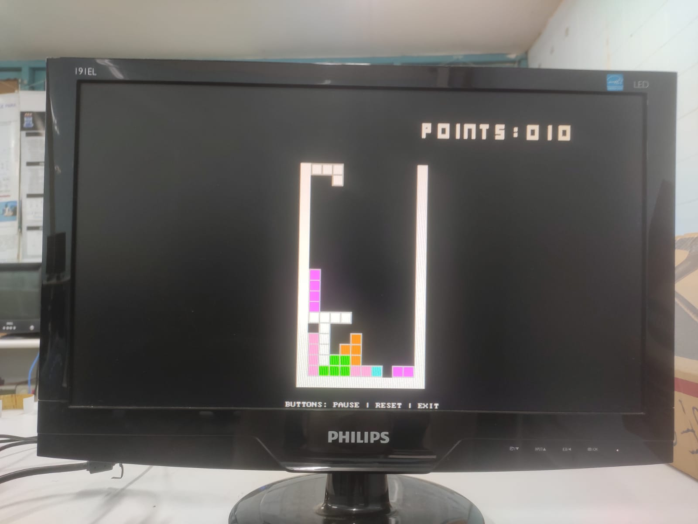
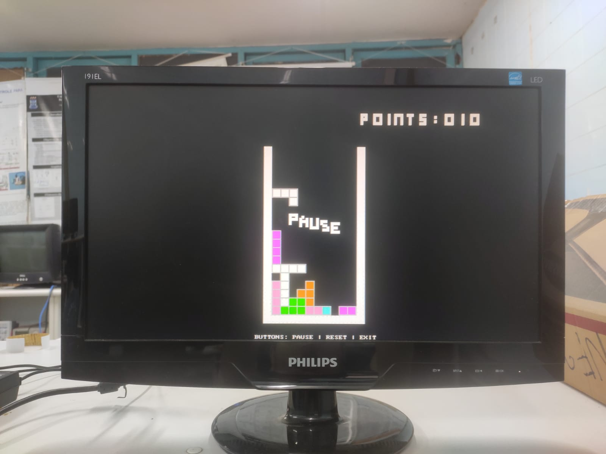
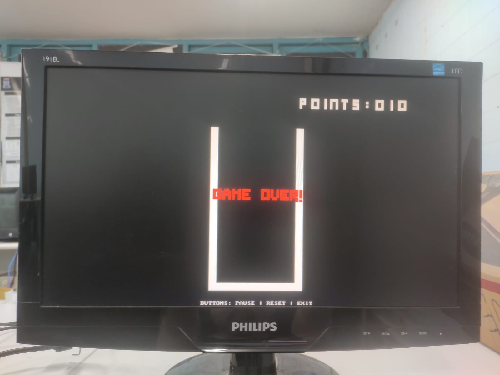
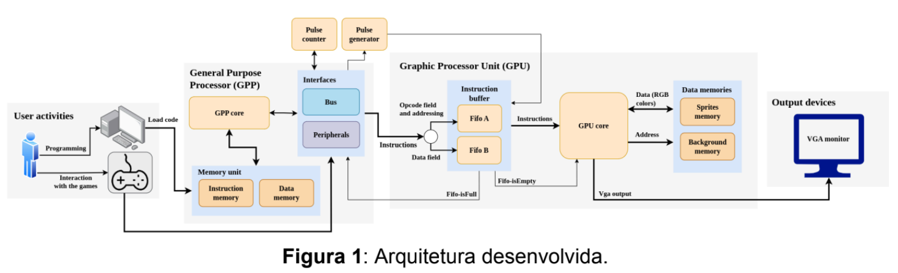
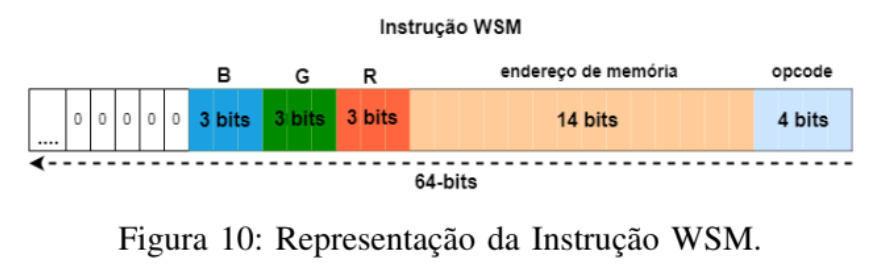

# [Versão em Português (Brasil)](README-PTbr.md)


# Access Library for GPU on FPGA in DE1-SoC for VGA Display Used in a Tetris Game

## Description
This project entails developing an assembly library that controls a GPU programmed on the FPGA of the DE1-SoC development board. This library is used in a Tetris game to display frames on a screen via the VGA output. The game is controlled using the accelerometer for movement and the DE1-SoC buttons for menu navigation. The GPU was developed by Gabriel Sá Barreto Alves as part of his Final Project.

## Index
1. [Description](#description)
2. [Objectives](#objectives)
3. [Requirements](#requirements)
4. [Hardware Setup](#hardware-setup)
5. [How to Compile and Run](#how-to-compile-and-run)
6. [Images](#images)
7. [Tests](#tests)
8. [Access and Operation of the GPU developed by Gabriel Sá Barreto Alves](#access-and-operation-of-the-gpu-developed-by-gabriel-sá-barreto-alves)
9. [Using Background Block](#using-background-block)
10. [Operation of the Accelerometer and Buttons](#operation-of-the-accelerometer-and-buttons)
11. [Final Analysis](#final-analysis)
12. [Additional Research Materials](#additional-research-materials)

## Objectives
- Understand the architecture of a GPU developed on an FPGA.
- Program in assembly for ARM architecture.
- Perform syscalls using assembly.
- Access files and map physical addresses to memory using assembly.
- Manipulate memory-mapped data using the Lightweight HPS-to-FPGA Bridge to access an FPGA on a DE1-SoC development board.
- Apply knowledge of interaction between C and assembly languages to develop an assembly library to access the GPU developed by Gabriel Sá Barreto Alves.
- Integrate the library into the Tetris game located at https://github.com/alexsami-lopes/Digital-Systems-Tetris.git to control frame projection on a monitor connected to the DE1-SoC’s VGA interface.

## Requirements
- DE1-SoC Development Board
- Accelerometer (ADXL345)
- VGA Monitor
- Buttons and LEDs
- Linux OS (preferably on ARM architecture)
- Knowledge of FPGA programming
- Basic understanding of C and assembly languages for hardware manipulation

## Hardware Setup
### DE1-SoC Board
  - **CPU**: ARM Cortex-A9
  - **Memory**: 1GB DDR3
  - **Video Output**: VGA
  - **Input**: Accelerometer, buttons

### Connections
1. **VGA Monitor**: Connect to the DE1-SoC VGA output.
2. **Accelerometer**: Connect to the I2C interface.
3. **7-Segment Display**: Connect to HEX display interface.
4. **Buttons**: Connect to GPIO for user input.
5. **LEDs**: Connect to GPIO for status indication.

### GPU developed by Gabriel Sá Barreto Alves
1. **GPU**: Installation of the GPU on the FPGA.
2. **Mapping**: Mapping using the Lightweight HPS-to-FPGA Bridge.

## How to Compile and Run
1. **Clone the Repository**:
    ```bash
    git clone https://github.com/alexsami-lopes/Tetris-Using-VGA-on-FPGA.git
    cd Tetris-Using-VGA-on-FPGA-main
    ```

2. **Compile the Code**:
    ```bash
    make
    ```

3. **Run the Game**:
    ```bash
    sudo ./tetris
    ```

   Ensure you have the necessary permissions to access `/dev/mem`.

## Images
### DE1-SoC Board and Hardware Setup


### VGA Screen Displaying the Game



<p align="center">
  
</p>

## Tests
During testing, the following steps were performed:
1. Development of a C library to test FPGA access and display a simple block on the screen via VGA.
2. Adapting the game to use the library and conducting performance tests.
3. Converting the library’s C logic into assembly and performing usage tests.
4. Ensuring that the game responds correctly to accelerometer inputs for piece movement.

## Access and Operation of the GPU developed by Gabriel Sá Barreto Alves
To access the GPU, it is necessary to open the `/dev/mem` file and map the FPGA’s physical addresses to memory. By manipulating the Lightweight HPS-to-FPGA Bridge, which connects the FPGA to the HPS using the base addresses `ALT_LWFPGASLVS_OFST` (0xFF200000) and mapping span `HW_REGS_SPAN` (0x04000000), instructions can be sent to the GPU using the `dataA`, `dataB`, `wrreg`, `reset_pulsecounter`, `screen`, and `wrfull` signals. The base addresses are 0x80, 0x70, 0xc0, 0x90, 0xa0, and 0xb0, respectively. `dataA` and `dataB` act as two queues, as shown in the GPU representation below. These queues receive GPU manipulation instructions, as described in detail at https://drive.google.com/file/d/1MlIlpB9TSnoPGEMkocr36EH9-CFz8psO/view. The `screen` signal marks the end of frame rendering, while `wrfull` indicates a full queue and must be checked before sending the next instruction. Instructions are decoded after sending a signal to `wrreg`.


## Using Background Block
Background blocks were chosen to create 8x8 and 16x16 blocks on the screen. This choice was made over using polygon instructions because the number of polygons that can be displayed simultaneously is limited. According to Gabriel’s Final Project, the Background Memory Write (WBM) instruction "stores or modifies the content present in Background Memory. It sets RGB values to fill background areas. Its fields are similar to the WSM instruction (Fig. 10), with the only difference being the 12-bit memory address field. The opcode is set to 0010. The background is divided into 8x8 pixel blocks, with each memory address corresponding to a block. With a resolution of 640x480 pixels, the screen is divided into 80x60 blocks."


## Operation of the Accelerometer and Buttons

### Accelerometer (ADXL345)
The ADXL345 accelerometer is used to detect the DE1-SoC board’s orientation and control Tetris piece movement. It’s connected to the DE1-SoC I2C interface and set to operate in ±16 g mode with a 100 Hz sampling rate. Accelerometer data is read periodically to determine the movement direction of the Tetris pieces. For instance, tilting the board backward accelerates piece descent, while tilting left or right moves pieces in the respective directions.

#### Accessing the ADXL345 Accelerometer Using I2C0

To access the ADXL345 on the DE1-SoC via I2C0 without a driver, follow these steps:

1. **Initialize I2C0**: Use `mmap()` to map the I2C0 base address (`0xFFC04000`) into the program’s memory space.

2. **Configure ADXL345**: Write the following values to the ADXL345 registers for ±16g mode and 100 Hz sampling:
   - Power Control (`0x2D`): `0x08` (measurement mode)
   - Data Format (`0x31`): `0x0B` (full resolution, ±16g)
   - Bandwidth Rate (`0x2C`): `0x0A` (100 Hz)

3. **Read Accelerometer Data**: Retrieve acceleration values from registers `0x32` to `0x37` for the X, Y, and Z axes, combining the high and low bytes.

4. **Process Data**: Use X and Y axis data to control the movement of Tetris pieces on the screen.

5. **Optional Interrupt Handling**: Enable activity/inactivity interrupts by writing to the **Interrupt Enable Register** (`0x2E`) and **Activity Control Register** (`0x27`).

This method allows direct communication with the accelerometer, providing control over its configuration and data reading without external libraries.

### Buttons
The DE1-SoC buttons are used to control game functions. Button presses were initially detected using the `intelfpgaup/KEY.h` driver. This time, manual memory mapping is used, as shown in the `is_button_pressed` function in the access library `src/graphics_fpga.s`. Each button is mapped in memory, and the first three perform specific actions in the game:
- **Pause Button**: Pauses the game when pressed. (first button)
- **Resume Button**: Resumes the game after a pause. (first button, after pause)
- **Reset Button**: Resets the game to its initial state. (second button, only when the game is over)
- **Exit Button**: Exits the game. (third button)

Button presses are detected and registered in mapped memory, triggering the corresponding action in the game. Game logic includes debounce handling to ensure accurate button detection.

## Final Analysis
The project achieved partial success, displaying the first game frame; however, a more thorough review of the code is required to identify why subsequent frames are not being displayed. Additionally, some modifications are needed in the game code to enable button use. Although tested in a separate C program, button functionalities were not fully adapted in the game code for `is_button_pressed` access. Furthermore, score display using the `draw_square_8x8` function still needs to be implemented.

## Additional Research Materials
- [DE1-SoC User Manual](datasheets/user_manual.pdf)
- [ADXL345 Accelerometer Datasheet](datasheets/Accelerometer.pdf)
- [Accelerometer Research Material](https://github.com/VimfulDang/ADXL345-Accelerometer-DE1-SOC/tree/master)
- [Gabriel Sá Barreto Alves' Final Project](https://drive.google.com/file/d/1MlIlpB9TSnoPGEMkocr36EH9-CFz8psO/view)
- [Research Material for Assembly Library Creation](https://github.com/GabrielSantosCruz/gpu-lib/blob/main/scripts/functions_lib.s)
- [Return to Index](#index)
